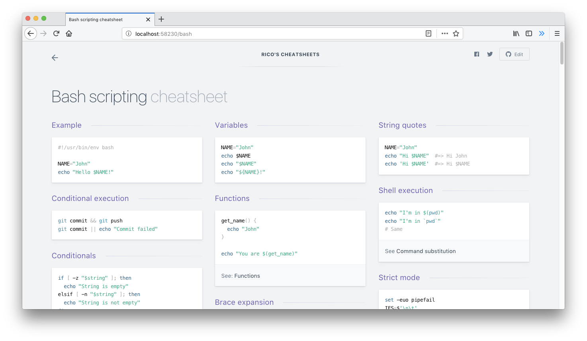

<h1 align='center'>Devhints</h1>

<blockquote align='center'>
TL;DR for developer documentation - a ridiculous collection of cheatsheets
</blockquote>

 

 
✨ <b><a href='https://devhints.io/'>devhints.io</a></b> ✨

 

---

See [CONTRIBUTING.md](CONTRIBUTING.md) for developer notes.

<h2 align='center'>Similar projects</h1>

- [Command Line Interface Pages](https://github.com/command-line-interface-pages)
- [tldr-pages](https://github.com/tldr-pages/tldr)
- [Cheat](https://github.com/cheat/cheat)
- [Eg](https://github.com/srsudar/eg)
