<style>
img{
    max-width:70%;
    /* height:auto; */
    margin:5px auto;
}
</style>


# CSS Grid - Container

A Grid Layout must have a parent element with the _display_ property set to _grid_ or _inline-grid_.

- **All direct child element(s) of the grid container automatically becomes grid items.**

## Grid Columns: 
The vertical lines of grid items are called columns.


## Grid Rows
The horizontal lines of grid items are called _rows_.


---

## Grid Gaps
The spaces between each column/row are called _gaps_.


<b>You can adjust the gap size by using one of the following properties:</b>

`grid-column-gap` : <em>between the columns</em>

`grid-row-gap`  : <em>between the rows</em>

`grid-gap` : <em>shorthand: background called row lines.</em>


<b>Examples: 
- Place a grid item at column line 1, and let it end on column line 3:</b>
```css
.item1 {
  grid-column-start: 1;
  grid-column-end: 3;
} 
```
- Place a grid item at row line 1, and let it end on row line 3:
 ```css
.item1 {
  grid-row-start: 1;
  grid-row-end: 3;
} 
```
---

## The `grid-template-columns` Property

- Defines the number of columns in your `grid` layout, and it can <u>define the width of each `column`.</u>

- The value is a space-separated-list, where each value defines the length of the respective column.


For Example: If you want your grid layout to contain 4 columns:

```css
.grid-container {
  display: grid;
  grid-template-columns: auto auto auto auto;
```

> Note: If you have more than 4 items in a 4 columns grid, the grid will **automatically add a new row to put the items in.**


<b>The `grid-template-columns` property can also be used to specify the size `(width)` of the `columns`.
Example:
```css
.grid-container {
  display: grid;
  grid-template-columns: 80px 200px auto 40px;
} 
```
---

## The grid-template-rows Property
- Defines the height of each row. The value is a space-separated-list, where each value defines the height of the respective row:
<b>Example:</b>
```css
.grid-container {
  display: grid;
  grid-template-rows: 80px 200px;
} 
```
---

## The `justify-content` Property
The `justify-content` property is used to align the whole grid inside the container.


> Note: The grid's total width has to be less than the container's width for the justify-content property to have any effect.

```css
.grid-container {
  display: grid;
  justify-content: space-evenly;
} 
```
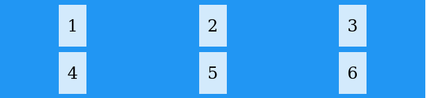

- The value `space-around` will give the columns equal amount of space around them:


- The value `space-between` will give the columns equal amount of space between them:

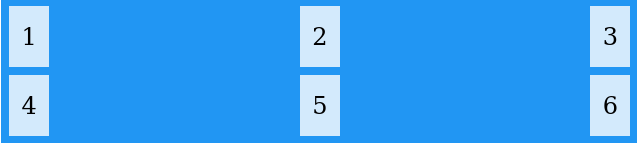

- The value `center` will align the grid in the middle of the container:


- The value `start` will align the grid at the beginning of the container:


- The value `end` will align the grid at the end of the container:


## The `align-content` Property

- Used to vertically align the whole grid inside the container.

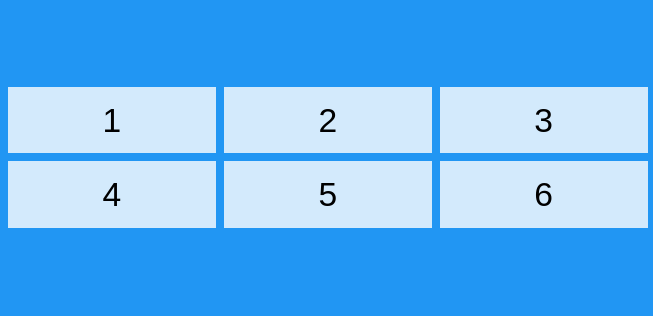

> Note: The grid's total height has to be less than the container's height for the align-content property to have any effect.

> The values are like `justify-content` values, BUT vertically align.

---

# CSS Grid Item [Child Elements - Items]

> A grid container contains grid items.

- By default, <u>a container has one grid item for each column, in each row, but you can style the grid items so that they will span multiple columns and/or rows.</u>

## The grid-column Property:

The `grid-column` property defines on which column(s) to place an item. You define where the item will start, and where the item will end.
> Note: The grid-column property is a shorthand property for the grid-column-start and the grid-column-end properties.

- To place an item, you can refer to line numbers, or use the keyword "span" to define how many columns the item will span.

> Examples:

- Make "item1" start on column 1 and end before column 5:
```css
.item1 {grid-column: 1 / span 3;}
```
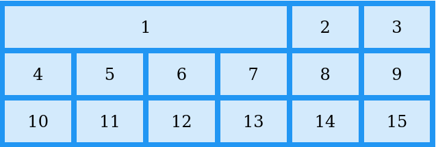

- Make "item1" start on column 1 and span 3 columns:
```css
.item2 {grid-column: 2 / span 3;}
```
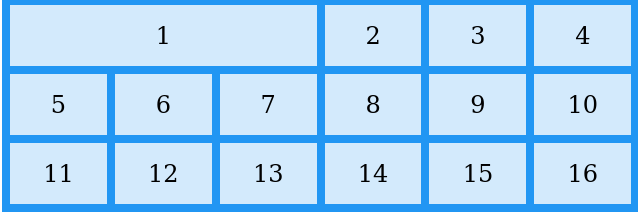

---
### The `grid-row` property:
- The grid-row property defines on which row to place an item. You define where the item will start, and where the item will end.

> Note: The grid-row property is a shorthand property for the grid-row-start and the grid-row-end properties.

> To place an item, you can refer to line numbers, or use the keyword "span" to define how many rows the item will span:
> <b>Examples:</b>

- Make "item1" start on row-line 1 and end on row-line 4:
```css
.item1 {grid-row: 1 / 4;}
```

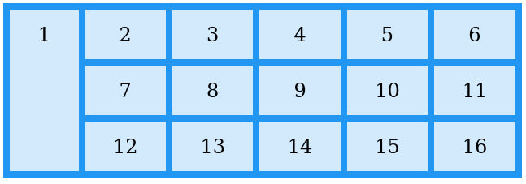

- Make "item1" start on row 1 and `span` 2 rows:
```css
.item1 {grid-row: 1 / span 2;} 
```
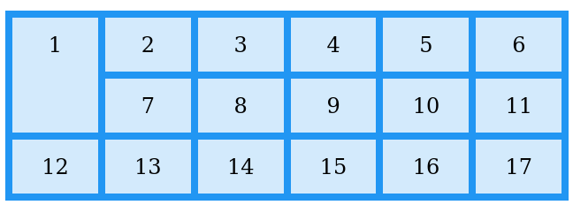

---

### The `grid-area` Property

<b>The grid-area property can be used as a shorthand property for the grid-row-start, grid-column-start, grid-row-end and the grid-column-end properties.</b>

#### The Syntax:

`grid-row-start / grid-column-start / grid-row-end / grid-column-end.`

> <b>Examples:</b>

- Make "item8" start on row-line 1 and column-line 2, and end on row-line 5 and column line 6:
```css
.item8 {grid-area: 1 / 2 / 5 / 6;}
```
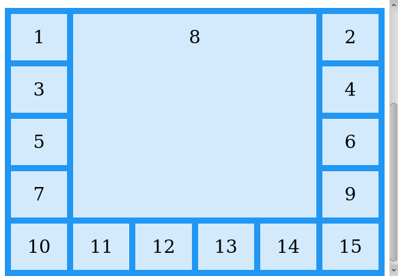

- Make "item8" start on row-line 2 and column-line 1, and span 2 rows and 3 columns:

```css
.item8 {grid-area: 2 / 1 / span 2 / span 3;}
```
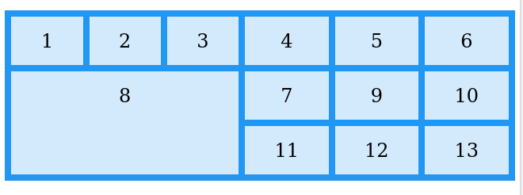

---

# Naming Grid Items

- The grid-area property can also be used to assign names to grid items.

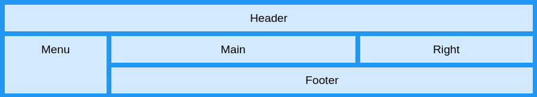

> Named grid items can be referred to by the grid-template-areas property of the grid container.

- Item1 gets the name "myArea" and spans all five columns in a five columns grid layout:

```css
.item1 {grid-area: myArea;}
.grid-container {
  grid-template-areas: 'myArea myArea myArea myArea myArea';
} 
```

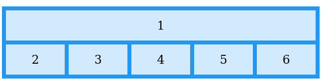
> Notes:
 - Each row is defined by apostrophes (' ')
 - The columns in each row is defined inside the apostrophes, separated by a space.
 - Also note: A period sign represents a grid item with no name.

>for Example:

- Let `myArea` span two columns in a five columns grid layout (period signs represent items with no name):
```css
.item1 {grid-area: myArea;}
.grid-container {
  grid-template-areas: 'myArea myArea . . .';
}
```

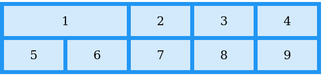

- To define two rows, define the column of the second row inside another set of apostrophes:

> for Example:

- Make "item1" span two columns and two rows:
```css
.grid-container {
  grid-template-areas: 'myArea myArea . . .' 'myArea myArea . . .';
} 
```

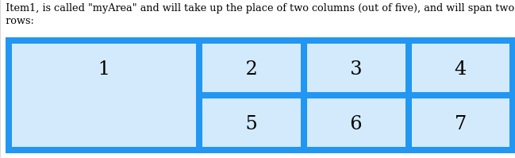

## Example

<b>Name all items, and make a ready-to-use webpage template:</b><br>
```html
<!DOCTYPE html>
<html>
<head>
<style>
.item1 { grid-area: header; }
.item2 { grid-area: menu; }
.item3 { grid-area: main; }
.item4 { grid-area: right; }
.item5 { grid-area: footer; }

.grid-container {
  display: grid;
  grid-template-areas:
    'header header header header header header'
    'menu main main main right right'
    'menu footer footer footer footer footer';
  grid-gap: 10px;
  background-color: #2196F3;
  padding: 10px;
}

.grid-container > div {
  background-color: rgba(255, 255, 255, 0.8);
  text-align: center;
  padding: 20px 0;
  font-size: 30px;
}
</style>
</head>
<body>
<h1>The grid-area Property</h1>
<p>You can use the <em>grid-area</em> property to name grid items.</p>
<p>You can refer to the name when you set up the grid layout, by using the <em>grid-template-areas</em> property on the grid container.</p>

<p>This grid layout contains six columns and three rows:</p>

<div class="grid-container">
  <div class="item1">Header</div>
  <div class="item2">Menu</div>
  <div class="item3">Main</div>  
  <div class="item4">Right</div>
  <div class="item5">Footer</div>
</div>
</body>
</html>
```
---

## The Order of the Items

- The Grid Layout allows us to position the items anywhere we like. The first item in the HTML code does not have to appear as the first item in the grid.

> Example:
```css
.item1 { grid-area: 1 / 3 / 2 / 4; }
.item2 { grid-area: 2 / 3 / 3 / 4; }
.item3 { grid-area: 1 / 1 / 2 / 2; }
.item4 { grid-area: 1 / 2 / 2 / 3; }
.item5 { grid-area: 2 / 1 / 3 / 2; }
.item6 { grid-area: 2 / 2 / 3 / 3; } 
```

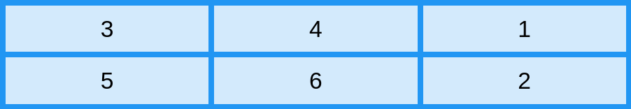

- You can re-arrange the order for certain screen sizes, by using media queries:
<style>
img{
    max-width:70%;
    /* height:auto; */
    margin:5px auto;
}
</style>


# CSS Grid - Container

A Grid Layout must have a parent element with the _display_ property set to _grid_ or _inline-grid_.

- **All direct child element(s) of the grid container automatically becomes grid items.**

## Grid Columns: 
The vertical lines of grid items are called columns.


## Grid Rows
The horizontal lines of grid items are called _rows_.


---

## Grid Gaps
The spaces between each column/row are called _gaps_.


<b>You can adjust the gap size by using one of the following properties:</b>

`grid-column-gap` : <em>between the columns</em>

`grid-row-gap`  : <em>between the rows</em>

`grid-gap` : <em>shorthand: background called row lines.</em>


<b>Examples: 
- Place a grid item at column line 1, and let it end on column line 3:</b>
```css
.item1 {
  grid-column-start: 1;
  grid-column-end: 3;
} 
```
- Place a grid item at row line 1, and let it end on row line 3:
 ```css
.item1 {
  grid-row-start: 1;
  grid-row-end: 3;
} 
```
---

## The `grid-template-columns` Property

- Defines the number of columns in your `grid` layout, and it can <u>define the width of each `column`.</u>

- The value is a space-separated-list, where each value defines the length of the respective column.


For Example: If you want your grid layout to contain 4 columns:

```css
.grid-container {
  display: grid;
  grid-template-columns: auto auto auto auto;
```

> Note: If you have more than 4 items in a 4 columns grid, the grid will **automatically add a new row to put the items in.**


<b>The `grid-template-columns` property can also be used to specify the size `(width)` of the `columns`.
Example:
```css
.grid-container {
  display: grid;
  grid-template-columns: 80px 200px auto 40px;
} 
```
---

## The grid-template-rows Property
- Defines the height of each row. The value is a space-separated-list, where each value defines the height of the respective row:
<b>Example:</b>
```css
.grid-container {
  display: grid;
  grid-template-rows: 80px 200px;
} 
```
---

## The `justify-content` Property
The `justify-content` property is used to align the whole grid inside the container.


> Note: The grid's total width has to be less than the container's width for the justify-content property to have any effect.

```css
.grid-container {
  display: grid;
  justify-content: space-evenly;
} 
```


- The value `space-around` will give the columns equal amount of space around them:


- The value `space-between` will give the columns equal amount of space between them:


- The value `center` will align the grid in the middle of the container:


- The value `start` will align the grid at the beginning of the container:


- The value `end` will align the grid at the end of the container:


## The `align-content` Property

- Used to vertically align the whole grid inside the container.


> Note: The grid's total height has to be less than the container's height for the align-content property to have any effect.

> The values are like `justify-content` values, BUT vertically align.

---

# CSS Grid Item [Child Elements - Items]

> A grid container contains grid items.

- By default, <u>a container has one grid item for each column, in each row, but you can style the grid items so that they will span multiple columns and/or rows.</u>

## The grid-column Property:

The `grid-column` property defines on which column(s) to place an item. You define where the item will start, and where the item will end.
> Note: The grid-column property is a shorthand property for the grid-column-start and the grid-column-end properties.

- To place an item, you can refer to line numbers, or use the keyword "span" to define how many columns the item will span.

> Examples:

- Make "item1" start on column 1 and end before column 5:
```css
.item1 {grid-column: 1 / span 3;}
```


- Make "item1" start on column 1 and span 3 columns:
```css
.item2 {grid-column: 2 / span 3;}
```


---
### The `grid-row` property:
- The grid-row property defines on which row to place an item. You define where the item will start, and where the item will end.

> Note: The grid-row property is a shorthand property for the grid-row-start and the grid-row-end properties.

> To place an item, you can refer to line numbers, or use the keyword "span" to define how many rows the item will span:
> <b>Examples:</b>

- Make "item1" start on row-line 1 and end on row-line 4:
```css
.item1 {grid-row: 1 / 4;}
```


- Make "item1" start on row 1 and `span` 2 rows:
```css
.item1 {grid-row: 1 / span 2;} 
```


---

### The `grid-area` Property

<b>The grid-area property can be used as a shorthand property for the grid-row-start, grid-column-start, grid-row-end and the grid-column-end properties.</b>

#### The Syntax:

`grid-row-start / grid-column-start / grid-row-end / grid-column-end.`

> <b>Examples:</b>

- Make "item8" start on row-line 1 and column-line 2, and end on row-line 5 and column line 6:
```css
.item8 {grid-area: 1 / 2 / 5 / 6;}
```


- Make "item8" start on row-line 2 and column-line 1, and span 2 rows and 3 columns:

```css
.item8 {grid-area: 2 / 1 / span 2 / span 3;}
```


---

# Naming Grid Items

- The grid-area property can also be used to assign names to grid items.


> Named grid items can be referred to by the grid-template-areas property of the grid container.

- Item1 gets the name "myArea" and spans all five columns in a five columns grid layout:

```css
.item1 {grid-area: myArea;}
.grid-container {
  grid-template-areas: 'myArea myArea myArea myArea myArea';
} 
```


> Notes:
 - Each row is defined by apostrophes (' ')
 - The columns in each row is defined inside the apostrophes, separated by a space.
 - Also note: A period sign represents a grid item with no name.

>for Example:

- Let `myArea` span two columns in a five columns grid layout (period signs represent items with no name):
```css
.item1 {grid-area: myArea;}
.grid-container {
  grid-template-areas: 'myArea myArea . . .';
}
```


- To define two rows, define the column of the second row inside another set of apostrophes:

> for Example:

- Make "item1" span two columns and two rows:
```css
.grid-container {
  grid-template-areas: 'myArea myArea . . .' 'myArea myArea . . .';
} 
```


## Example

<b>Name all items, and make a ready-to-use webpage template:</b><br>
```html
<!DOCTYPE html>
<html>
<head>
<style>
.item1 { grid-area: header; }
.item2 { grid-area: menu; }
.item3 { grid-area: main; }
.item4 { grid-area: right; }
.item5 { grid-area: footer; }

.grid-container {
  display: grid;
  grid-template-areas:
    'header header header header header header'
    'menu main main main right right'
    'menu footer footer footer footer footer';
  grid-gap: 10px;
  background-color: #2196F3;
  padding: 10px;
}

.grid-container > div {
  background-color: rgba(255, 255, 255, 0.8);
  text-align: center;
  padding: 20px 0;
  font-size: 30px;
}
</style>
</head>
<body>
<h1>The grid-area Property</h1>
<p>You can use the <em>grid-area</em> property to name grid items.</p>
<p>You can refer to the name when you set up the grid layout, by using the <em>grid-template-areas</em> property on the grid container.</p>

<p>This grid layout contains six columns and three rows:</p>

<div class="grid-container">
  <div class="item1">Header</div>
  <div class="item2">Menu</div>
  <div class="item3">Main</div>  
  <div class="item4">Right</div>
  <div class="item5">Footer</div>
</div>
</body>
</html>
```
---

## The Order of the Items

- The Grid Layout allows us to position the items anywhere we like. The first item in the HTML code does not have to appear as the first item in the grid.

> Example:
```css
.item1 { grid-area: 1 / 3 / 2 / 4; }
.item2 { grid-area: 2 / 3 / 3 / 4; }
.item3 { grid-area: 1 / 1 / 2 / 2; }
.item4 { grid-area: 1 / 2 / 2 / 3; }
.item5 { grid-area: 2 / 1 / 3 / 2; }
.item6 { grid-area: 2 / 2 / 3 / 3; } 
```


- You can re-arrange the order for certain screen sizes, by using media queries:

> for Example:
```css
@media only screen and (max-width: 500px) {
  .item1 { grid-area: 1 / span 3 / 2 / 4; }
  .item2 { grid-area: 3 / 3 / 4 / 4; }
  .item3 { grid-area: 2 / 1 / 3 / 2; }
  .item4 { grid-area: 2 / 2 / span 2 / 3; }
  .item5 { grid-area: 3 / 1 / 4 / 2; }
  .item6 { grid-area: 2 / 3 / 3 / 4; }
} 
```

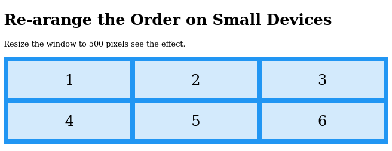

---

# CSS TEMPLATES:
https://www.w3schools.com/css/css_templates.asp


> for Example:
```css
@media only screen and (max-width: 500px) {
  .item1 { grid-area: 1 / span 3 / 2 / 4; }
  .item2 { grid-area: 3 / 3 / 4 / 4; }
  .item3 { grid-area: 2 / 1 / 3 / 2; }
  .item4 { grid-area: 2 / 2 / span 2 / 3; }
  .item5 { grid-area: 3 / 1 / 4 / 2; }
  .item6 { grid-area: 2 / 3 / 3 / 4; }
} 
```


---

# CSS TEMPLATES:
https://www.w3schools.com/css/css_templates.asp


