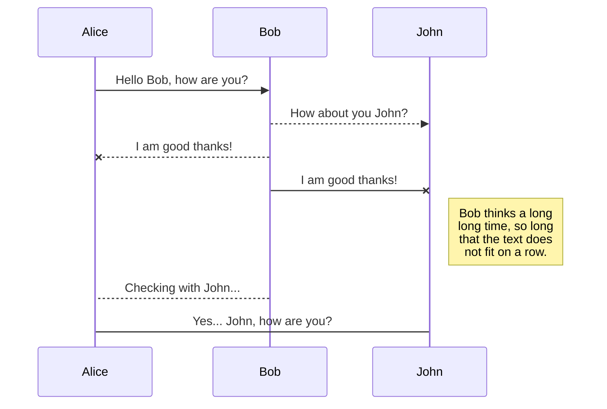
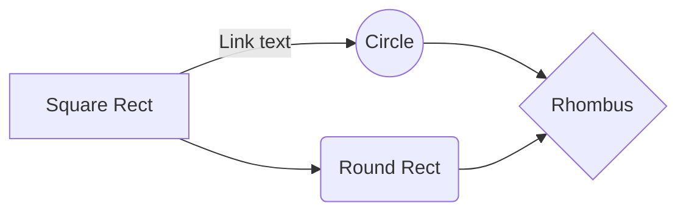

## Reference

{:.-three-column}

### Headers

```markdown
# h1
## h2
### h3
#### h4
##### h5
###### h6
```

```markdown
Header 1
========
```

```markdown
Header 2
--------
```

### Emphasis

```markdown
*italic*
_italic_
```

```markdown
**bold**
__bold__
```

```markdown
***bold italic***
___bold italic___
```

```markdown
~~strikethrough~~
```

```markdown
`code`
```

### Lists

```markdown
* Item 1
  * Nested Item 1
* Item 2
```

```markdown
- Item 1
  - Nested Item 1
- Item 2
```

```markdown
- [ ] Checkbox off
- [x] Checkbox on
```

```markdown
1. Item 1
2. Item 2
```

### Links

```markdown
[link](http://google.com)
```

```markdown
[link][google]
[google]: http://google.com
```

```markdown
<http://google.com>
```

### Images

```markdown


```

```markdown
![Image alt text][img]
[img]: http://foo.com/img.jpg
```

```markdown
![Image alt text][img_base64]
[img_base64]: <data:image/png;base64,...>
```

### Code

```markdown
`inline code`
```

```
    4 space indent
    makes a code block
```

~~~markdown
```
code fences
```
~~~

~~~markdown
```js
codeFences.withLanguage()
```
~~~

### Blockquotes

```markdown
> This is
> a blockquote
>
> > Nested
> > Blockquote
```

### Horizontal line

```markdown
----
```

```markdown
****
```

### Tables

```markdown
| Column 1 Heading | Column 2 Heading |
| ---------------- | ---------------- |
| Some content     | Other content    |
```

```markdown
Column 1 Heading | Column 2 Heading
--- | ---
Some content | Other content
```

### KaTeX

You can render LaTeX mathematical expressions using [KaTeX](https://khan.github.io/KaTeX/):

```
The *Gamma function* satisfying $\Gamma(n) = (n-1)!\quad\forall n\in\mathbb N$ is via the Euler integral

$$
\Gamma(z) = \int_0^\infty t^{z-1}e^{-t}dt\,.
$$
```

The *Gamma function* satisfying $\Gamma(n) = (n-1)!\quad\forall n\in\mathbb N$ is via the Euler integral

$$
\Gamma(z) = \int_0^\infty t^{z-1}e^{-t}dt\,.
$$

> You can find more information about **LaTeX** mathematical expressions [here](http://meta.math.stackexchange.com/questions/5020/mathjax-basic-tutorial-and-quick-reference).

### UML diagrams

You can render UML diagrams using [Mermaid](https://mermaidjs.github.io/). For example, this will produce a sequence diagram:

~~~markdown

~~~


And this will produce a flow chart:

~~~markdown

~~~


